# 🚗 AutoManager - Sistema de Gestão para Oficina Mecânica

## 📋 Descrição do Projeto

O AutoManager é um sistema projetado para auxiliar oficinas mecânicas no gerenciamento de clientes, veículos, ordens de serviço, orçamentos e histórico de manutenção.

O objetivo do sistema é centralizar as informações da oficina em uma única plataforma, facilitando o acompanhamento dos serviços realizados, o controle dos veículos atendidos e a comunicação entre clientes, atendentes e mecânicos.

Este projeto foi desenvolvido para a disciplina de Projeto de Software com foco na modelagem UML, arquitetura de software e documentação de sistemas utilizando PlantUML.

---

## 🎯 Objetivos

* Gerenciar clientes e veículos.
* Controlar ordens de serviço.
* Emitir e aprovar orçamentos.
* Registrar diagnósticos técnicos.
* Manter histórico de manutenções.
* Gerar relatórios gerenciais.

---

## 👥 Atores do Sistema

### Cliente

Responsável por solicitar serviços, consultar orçamentos e aprovar a execução dos reparos.

### Atendente

Responsável pelo cadastro de clientes e veículos, abertura de ordens de serviço e atendimento inicial.

### Mecânico

Responsável por realizar diagnósticos, registrar serviços executados e finalizar ordens de serviço.

### Administrador

Responsável pelo gerenciamento geral da oficina e emissão de relatórios.

---

## 📚 Casos de Uso

| ID    | Caso de Uso                |
| ----- | -------------------------- |
| UC-01 | Cadastrar Cliente          |
| UC-02 | Cadastrar Veículo          |
| UC-03 | Abrir Ordem de Serviço     |
| UC-04 | Registrar Diagnóstico      |
| UC-05 | Emitir Orçamento           |
| UC-06 | Aprovar Orçamento          |
| UC-07 | Executar Serviço           |
| UC-08 | Finalizar Ordem de Serviço |
| UC-09 | Consultar Relatórios       |

---

## 📝 Histórias de Usuário

### HU-01

Como atendente, desejo cadastrar clientes para manter os registros atualizados.

### HU-02

Como atendente, desejo cadastrar veículos para associá-los aos respectivos clientes.

### HU-03

Como mecânico, desejo registrar diagnósticos para documentar os problemas identificados.

### HU-04

Como cliente, desejo aprovar orçamentos para autorizar a execução dos serviços.

### HU-05

Como administrador, desejo visualizar relatórios para acompanhar o desempenho da oficina.

---

# 🏗 Arquitetura do Sistema

O sistema AutoManager foi projetado utilizando arquitetura em camadas, separando as responsabilidades entre interface, regras de negócio e persistência de dados.

## Camada de Apresentação

Responsável pela interação dos usuários com o sistema através de uma aplicação web desenvolvida em React.

## Camada de Aplicação

Responsável por receber as requisições dos usuários e coordenar as operações do sistema através de APIs REST desenvolvidas com Spring Boot.

## Camada de Negócio

Responsável pelas regras de negócio relacionadas ao gerenciamento de clientes, veículos, ordens de serviço e orçamentos.

## Camada de Persistência

Responsável pelo acesso ao banco de dados PostgreSQL utilizando Hibernate/JPA.

## Banco de Dados

Responsável pelo armazenamento de clientes, veículos, ordens de serviço e serviços realizados.

---

# 📊 Diagramas UML

## Diagrama de Casos de Uso

Localização:


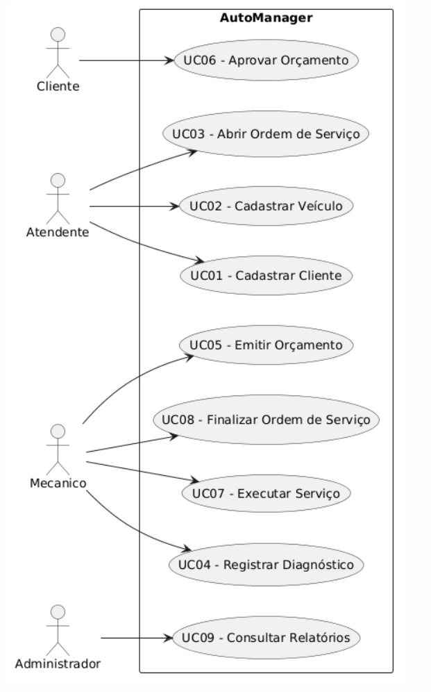


## Diagrama de Classes

Localização:

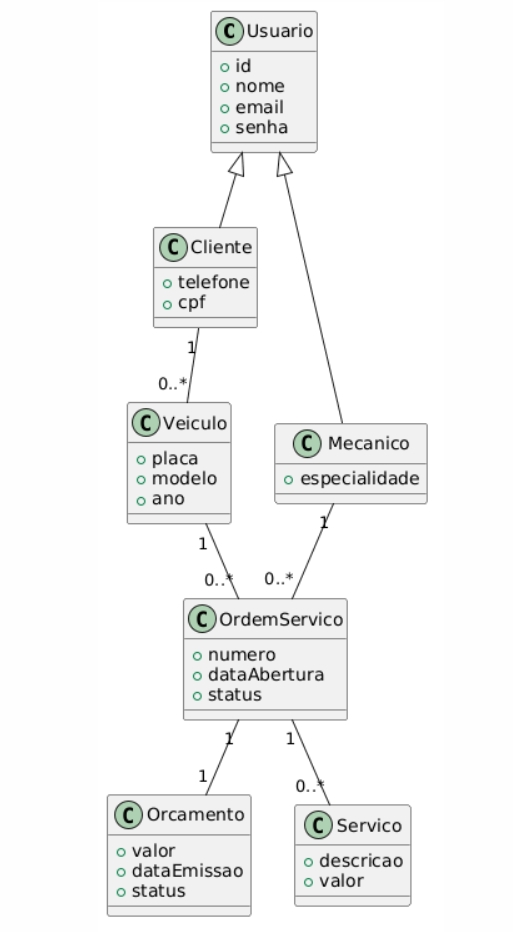

## Diagramas de Sequência

### Abrir Ordem de Serviço

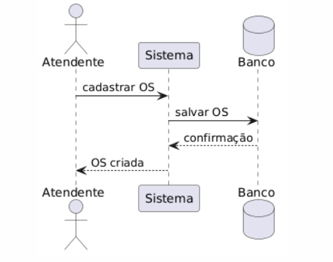

### Aprovar Orçamento

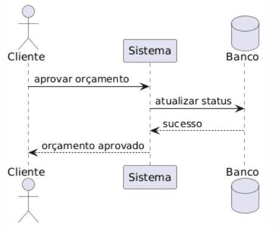

### Finalizar Ordem de Serviço

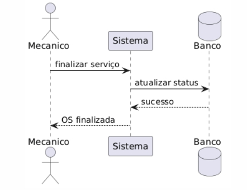

## Diagramas de Comunicação

```text
/docs/diagramas/comunicacao/
```

## Diagrama de Estados

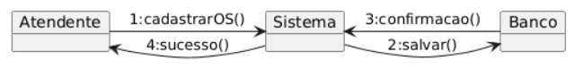

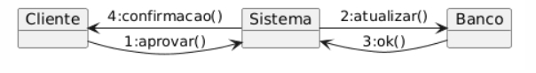

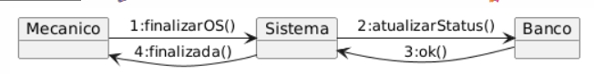

## Diagrama de Componentes

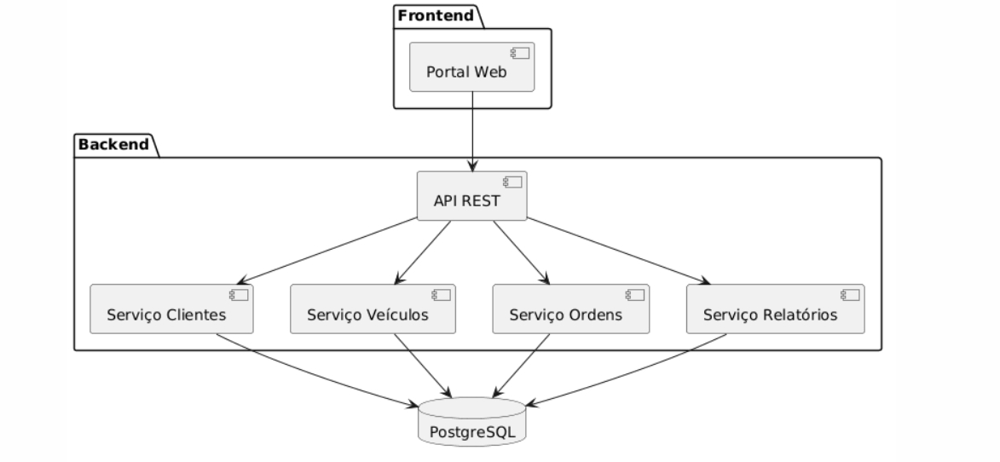

## Diagrama de Implantação

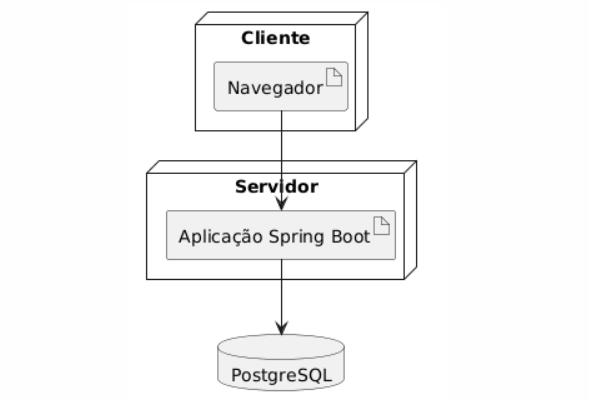

## Modelo de Dados

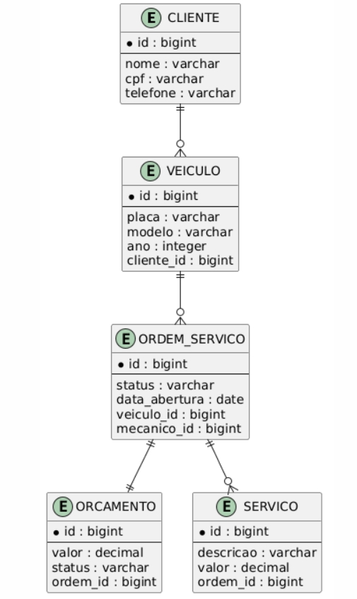

---

# 🛠 Tecnologias Utilizadas

## Modelagem

* UML 2.5
* PlantUML

## Arquitetura

* Arquitetura em Camadas
* Orientação a Objetos

## Infraestrutura & DevOps

* Containerização: Docker
* Orquestração: Docker Compose
* Cloud: AWS EC2
* Banco Gerenciado: AWS RDS PostgreSQL
* CI/CD: GitHub Actions

## Backend

* Linguagem: Java 17
* Framework: Spring Boot 3.3
* Banco de Dados: PostgreSQL 16
* ORM: Hibernate / JPA
* Autenticação: Spring Security + JWT

## Frontend

* Framework: React 19
* Linguagem: TypeScript
* Estilização: Bootstrap 5.3
* Gerenciamento de Estado: Context API
* Build Tool: Vite

---

# 📁 Estrutura do Repositório

```text
.
├── README.md
├── docs
│   ├── diagramas
│   │   ├── casos-de-uso.puml
│   │   ├── classes.puml
│   │   ├── componentes.puml
│   │   ├── implantacao.puml
│   │   ├── estados.puml
│   │   ├── modelo-dados.puml
│   │   ├── seq-abrir-os.puml
│   │   ├── seq-aprovar-orcamento.puml
│   │   ├── seq-finalizar-os.puml
│   │   └── comunicacao
│   │       ├── abrir-os.puml
│   │       ├── aprovar-orcamento.puml
│   │       └── finalizar-os.puml
```

---

# 👨‍💻 Autor

Rafael Caetano

Disciplina: Projeto de Software

Curso: Engenharia de Software

---

# 📄 Licença

Projeto acadêmico desenvolvido exclusivamente para fins educacionais.
